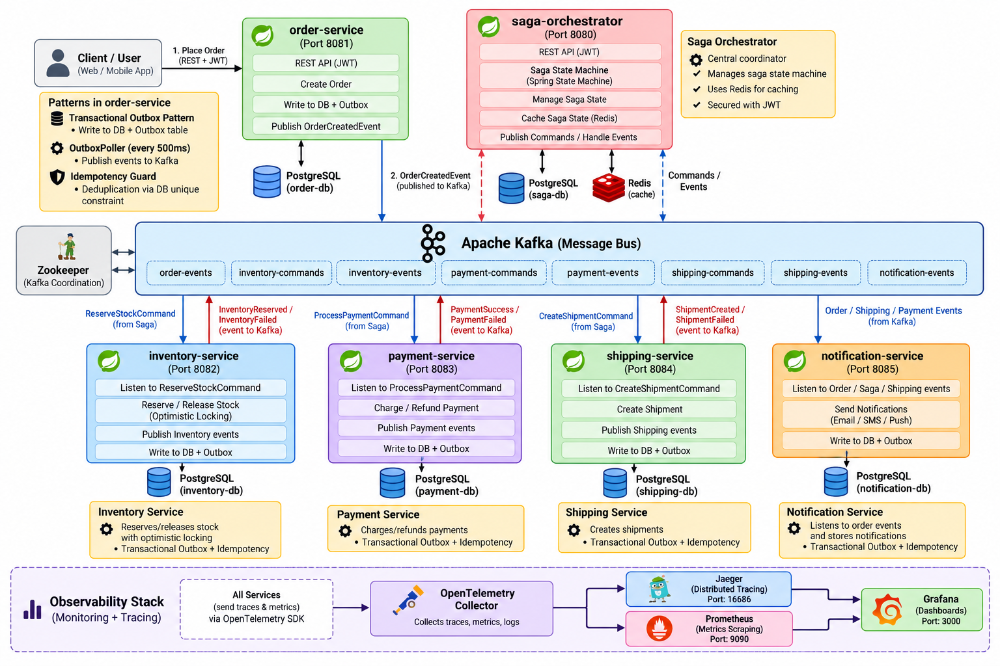
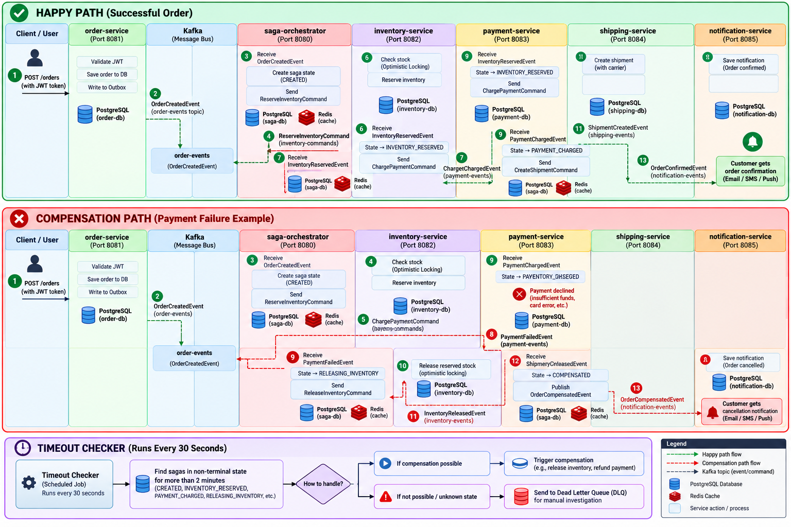

# Distributed Order Fulfillment System — Saga Orchestration

[](https://openjdk.org/projects/jdk/17/)
[](https://spring.io/projects/spring-boot)
[](https://kafka.apache.org/)
[](https://www.postgresql.org/)
[](LICENSE)

---

## About the Project

This is a **production-grade, event-driven microservices system** that simulates a real-world e-commerce order fulfillment pipeline. When a customer places an order, the system coordinates across multiple independent services — inventory, payment, and shipping — using the **Saga Orchestration** pattern to ensure data consistency without distributed transactions.

The core challenge this project solves: in a microservices architecture, a single business operation (placing an order) spans multiple services and databases. If payment succeeds but shipping fails, the system must automatically roll back the payment and release the reserved inventory. This is the **compensation problem**, and this project solves it reliably using a central saga orchestrator backed by a Spring State Machine.

### What makes this production-grade?

- **No message loss** — every service uses the Transactional Outbox pattern. Kafka messages are written to the database in the same transaction as the business change, so a service crash between DB commit and Kafka send can never lose a message.
- **No duplicate processing** — every Kafka consumer is protected by an Idempotency Guard. If Kafka delivers the same event twice (at-least-once delivery), the second delivery is silently skipped using a DB unique constraint.
- **No race conditions** — the inventory service uses JPA optimistic locking (`@Version`) instead of row-level locks, allowing high concurrency with automatic retry on conflict.
- **Crash-safe saga state** — the orchestrator persists every state transition to PostgreSQL before sending the next command. A restart mid-saga picks up exactly where it left off.
- **Automatic timeout handling** — a background checker runs every 30 seconds and triggers compensation for sagas stuck longer than 2 minutes. Sagas stuck in compensation itself are escalated to a Dead Letter Queue for manual intervention.
- **Full observability** — distributed tracing via OpenTelemetry + Jaeger, metrics via Prometheus + Grafana, structured logging across all services.

### The Order Lifecycle

When an order is placed, it goes through the following stages:

1. **Order Created** — the order is persisted and an event is published to Kafka
2. **Inventory Reserved** — stock is checked and reserved with optimistic locking
3. **Payment Charged** — the customer's payment is processed
4. **Shipment Created** — a shipment record is created
5. **Order Confirmed** — the saga completes successfully

If any step fails, the system automatically compensates in reverse:
- Shipment failure → refund payment → release inventory → order compensated
- Payment failure → release inventory → order compensated
- Inventory failure → order failed immediately (nothing to undo)

---

## Architecture Diagram



---

## Workflow Diagram



---

## Services Overview

| Service | Port | Database | Responsibility |
|---|---|---|---|
| `order-service` | 8081 | `order_db` | Accepts orders via REST, publishes `OrderCreatedEvent` |
| `saga-orchestrator` | 8080 | `saga_db` | Coordinates the saga, manages state machine |
| `inventory-service` | 8082 | `inventory_db` | Reserves and releases stock |
| `payment-service` | 8083 | `payment_db` | Charges and refunds payments |
| `shipping-service` | 8084 | `shipping_db` | Creates shipments |
| `notification-service` | 8085 | `notification_db` | Stores order event notifications |

---

## Kafka Topics

| Topic | Producer | Consumer | Purpose |
|---|---|---|---|
| `order.events` | order-service, saga-orchestrator | saga-orchestrator, notification-service | Order lifecycle events |
| `inventory.events` | inventory-service | saga-orchestrator | Inventory results |
| `payment.events` | payment-service | saga-orchestrator | Payment results |
| `shipping.events` | shipping-service | saga-orchestrator | Shipping results |
| `cmd.reserve-inventory` | saga-orchestrator | inventory-service | Reserve stock command |
| `cmd.release-inventory` | saga-orchestrator | inventory-service | Release stock command |
| `cmd.charge-payment` | saga-orchestrator | payment-service | Charge payment command |
| `cmd.refund-payment` | saga-orchestrator | payment-service | Refund payment command |
| `cmd.create-shipment` | saga-orchestrator | shipping-service | Create shipment command |
| `saga.dlq` | saga-orchestrator | Manual | Dead letter queue for stuck sagas |

---

## Key Design Patterns

### Transactional Outbox
Every service writes Kafka messages to an `outbox_events` table **within the same DB transaction** as the business change. The `OutboxPoller` picks up unpublished rows every 500ms and sends them to Kafka, eliminating the dual-write problem.

### Idempotency Guard
Every Kafka consumer uses an `IdempotencyGuard` that inserts a `processed_events` row before processing. If the same event is delivered twice, the DB unique constraint rejects the second insert and the handler skips it safely.

### Optimistic Locking
`inventory-service` uses JPA `@Version` on `StockItem` to handle concurrent reservation requests without row-level locks. Conflicts trigger a retry (up to 5 attempts with exponential backoff).

### Saga State Machine
`saga-orchestrator` uses Spring State Machine to enforce valid state transitions. The state is persisted to PostgreSQL after every transition, making it crash-safe.

---

## Saga State Machine


---

## Tech Stack

| Category | Technology |
|---|---|
| Language | Java 17 |
| Framework | Spring Boot 3.2.5 |
| Messaging | Apache Kafka (Confluent 7.6.1) |
| Databases | PostgreSQL 16 |
| Cache | Redis 7 |
| State Machine | Spring State Machine 3.2.1 |
| Migrations | Flyway |
| Auth | JWT (jjwt 0.11.5) |
| Observability | OpenTelemetry, Jaeger, Prometheus, Grafana |
| Build | Gradle 8.7 |
| Containerization | Docker + Docker Compose |

---

## Getting Started

### Prerequisites
- Docker & Docker Compose
- Java 17+

### Run the full stack

```bash
# Build all service JARs
./gradlew build -x test

# Start everything (Kafka, PostgreSQL x6, Redis, all services, observability)
docker-compose up --build
```

### Service URLs

| Service | URL |
|---|---|
| order-service API | http://localhost:8081 |
| saga-orchestrator | http://localhost:8080 |
| inventory-service | http://localhost:8082 |
| payment-service | http://localhost:8083 |
| shipping-service | http://localhost:8084 |
| notification-service | http://localhost:8085 |
| Jaeger UI | http://localhost:16686 |
| Prometheus | http://localhost:9090 |
| Grafana | http://localhost:3000 (admin/admin) |

### Create an Order

```bash
curl -X POST http://localhost:8081/orders \
  -H "Content-Type: application/json" \
  -H "Authorization: Bearer <your-jwt-token>" \
  -d '{
    "customerId": "11111111-1111-1111-1111-111111111111",
    "itemId":     "22222222-2222-2222-2222-222222222222",
    "quantity":   2,
    "totalPrice": 49.99
  }'
```

> **Simulate payment failure:** use a `customerId` starting with `00000000-` — the payment stub will decline it and trigger the full compensation flow.

---

## Project Structure

```
order-fulfillment-system/
├── common/                     # Shared DTOs, events, outbox, idempotency, JWT filter
├── order-service/              # REST API, order domain
├── saga-orchestrator/          # Saga state machine, timeout checker, metrics
├── inventory-service/          # Stock management
├── payment-service/            # Payment processing
├── shipping-service/           # Shipment creation
├── notification-service/       # Event notifications
├── observability/              # Prometheus, Grafana, OTel Collector configs
├── docker-compose.yml
├── build.gradle                # Root Gradle config
└── settings.gradle
```

---

## Environment Variables

| Variable | Default | Description |
|---|---|---|
| `DB_HOST` | `localhost` | PostgreSQL host |
| `DB_PORT` | varies per service | PostgreSQL port |
| `DB_USER` | varies per service | PostgreSQL username |
| `DB_PASS` | varies per service | PostgreSQL password |
| `KAFKA_BOOTSTRAP` | `localhost:9092` | Kafka bootstrap servers |
| `REDIS_HOST` | `localhost` | Redis host (saga-orchestrator only) |
| `REDIS_PORT` | `6379` | Redis port (saga-orchestrator only) |
| `JWT_SECRET` | `change-me-in-production-min-32-chars!!` | HS256 JWT signing secret |
| `OTEL_ENDPOINT` | `http://localhost:4317` | OpenTelemetry collector endpoint |

---

## License

MIT
